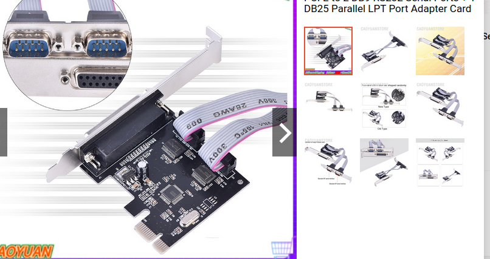

# Linux-CNCDriver-RTOS-Parport

Desktop computer driver running LinuxCNC sending signals driving the CNC milling machine using the IEEE-1284 parallel port. IEEE 1284 is a standard that defines bi-directional parallel communications between computers and other devices. 

Wassalam.
WRY

